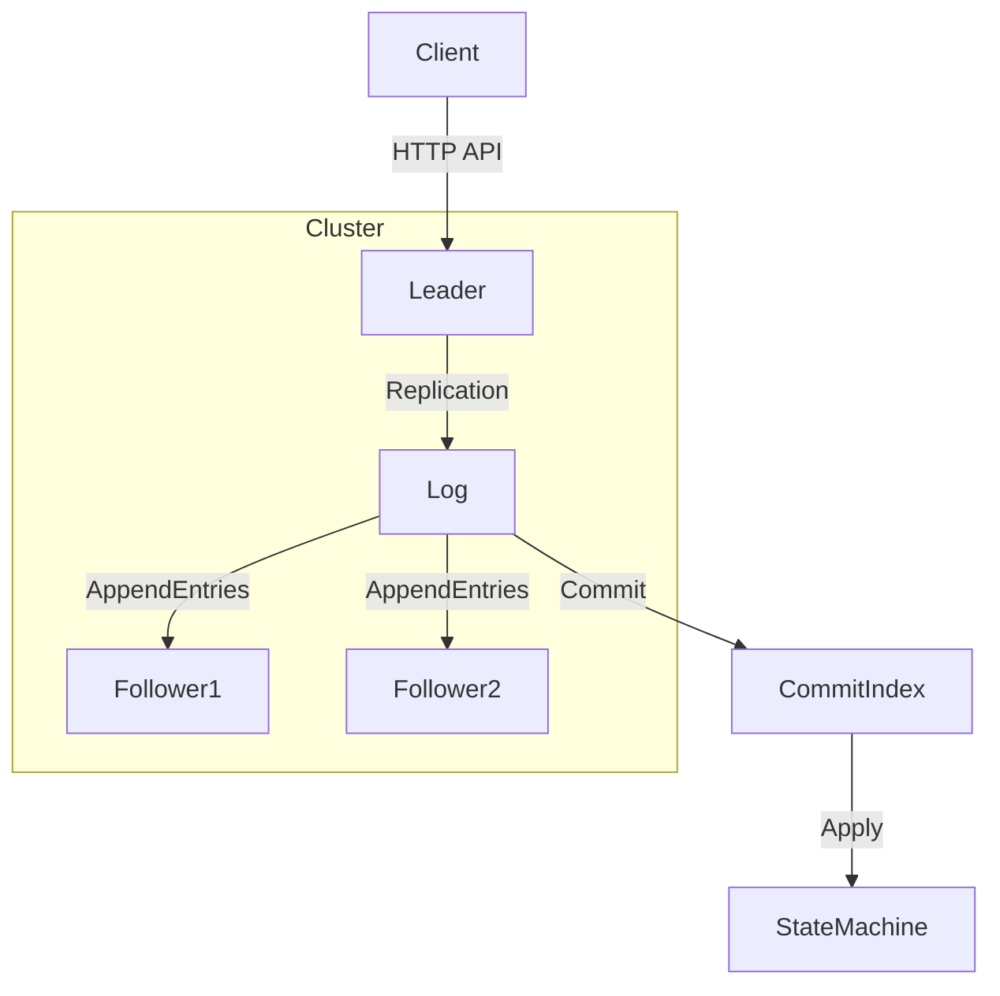

# Distributed Key-Value Store using Raft Consensus

A fault-tolerant, strongly consistent key-value store implemented from scratch in Go using the **Raft consensus algorithm**.
The system remains available under node crashes and automatically elects a new leader while preserving data consistency.

##  Features

### Raft Consensus (Core Implementation)
- **Leader election** with randomized timeouts.
- **Heartbeats** using `AppendEntries`.
- **Log replication** with majority-based commitment.
- **Safe state machine application**.

### Fault Tolerance
- **Survives leader crashes**.
- **Automatic failover** and re-election.
- **No data loss** after failover.

### Strong Consistency
- **Linearizable writes**.
- Commands committed only after **majority replication**.
- Followers reject stale leaders.

### Distributed Key-Value Store
- **SET** and **GET** operations.
- State machine driven by committed Raft log entries.
- **HTTP API** for client interaction.

### Production-Oriented Details
- **gRPC-based** Raft RPCs.
- **Connection pooling** to avoid port exhaustion.
- **Tuned election** and RPC timeouts.
- **Deadlock-free** concurrency design.

##  Architecture Overview



- **Only the leader** accepts client writes.
- All writes are appended to the **Raft log**.
- Entries are replicated to followers via `AppendEntries`.
- Once a **majority** acknowledges, the entry is committed and applied.

##  Project Structure

```text
distributed-kv-raft/
├── cmd/
│   └── node/
│       └── main.go        # Node bootstrap & HTTP server
├── raft/
│   ├── election.go        # Leader election & voting
│   ├── log.go             # Log replication & heartbeats
│   ├── raft.go            # Core Raft state machine
│   └── state.go           # Apply committed entries (if separated)
├── rpc/
│   └── raft.proto         # gRPC Raft definitions
└── README.md
```

## ▶️ How to Run (3-Node Cluster)

### 1️⃣ Build
```bash
go build ./...
```

### 2️⃣ Start Nodes (separate terminals)

**Node 1**
```bash
go run cmd/node/main.go \
  --id=node1 \
  --http_addr=127.0.0.1:8001 \
  --raft_addr=127.0.0.1:9001 \
  --peers=127.0.0.1:9002,127.0.0.1:9003
```

**Node 2**
```bash
go run cmd/node/main.go \
  --id=node2 \
  --http_addr=127.0.0.1:8002 \
  --raft_addr=127.0.0.1:9002 \
  --peers=127.0.0.1:9001,127.0.0.1:9003
```

**Node 3**
```bash
go run cmd/node/main.go \
  --id=node3 \
  --http_addr=127.0.0.1:8003 \
  --raft_addr=127.0.0.1:9003 \
  --peers=127.0.0.1:9001,127.0.0.1:9002
```

> One node will automatically become the leader.

##  Client API

### SET (Write)
```bash
curl -X POST http://127.0.0.1:8001/set \
  -H "Content-Type: application/json" \
  -d '{"key":"demo","value":"it_works"}'
```

### GET (Read)
```bash
curl http://127.0.0.1:8001/get?key=demo
```

##  Fault Tolerance Test (Verified)

### Test Scenario
1. Write data to leader.
2. **Kill leader process**.
3. Observe new leader election.
4. Read data from surviving node.

### Result
- New leader elected automatically.
- Data remains consistent.
- System continues serving requests.

##  Key Engineering Challenges Solved

### Deadlock Prevention
Fixed a subtle deadlock where `AppendEntries` handlers triggered election timer resets under the same mutex.

### Correct Commit Index Advancement
Commit index advances only when a log entry is replicated on a **majority**.

### Network Stability
Implemented **gRPC connection reuse** to prevent ephemeral port exhaustion.

##  Limitations & Future Work
- Snapshotting / log compaction.
- Persistent storage (disk-backed logs).
- Read-only linearizable queries (lease-read).
- Metrics & observability.

## Why This Project Matters
This project demonstrates:
- Deep understanding of distributed systems.
- Correct implementation of **Raft consensus**.
- Practical handling of failure scenarios.
- Production-minded engineering decisions.

##  Tech Stack
- **Language**: Go
- **RPC**: gRPC
- **Concurrency**: Goroutines, Mutexes, Channels
- **Protocols**: Raft Consensus Algorithm
